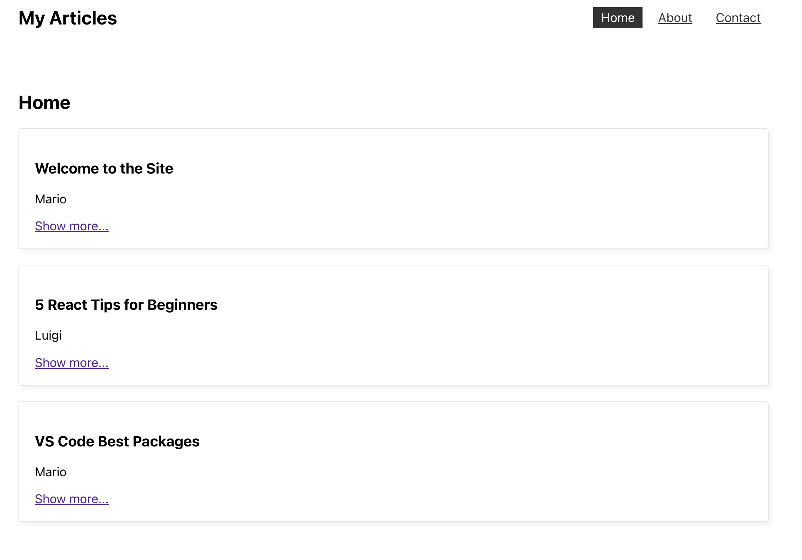

# React_Multisite_Page

Repository created following this [Udemy Course](https://www.udemy.com/course/build-web-apps-with-react-firebase/) to practice the following basic React concepts:

- React router

## Application

Application fetchs a list of articles from a json-server database and displays it within the main component. Also, there is a nav bar where the end user can click to navigate through the different components.



## Run Locally

Clone the project

```bash
  git clone https://github.com/pedrolopezbiedma/React_Multipage_Site.git
```

Install dependencies

```bash
  npm install
```

Start the server in another console

```bash
  npm run server
```

Start the application

```bash
  npm run start
```

## Authors

- [@pedrolopezbiedma](https://github.com/pedrolopezbiedma)
